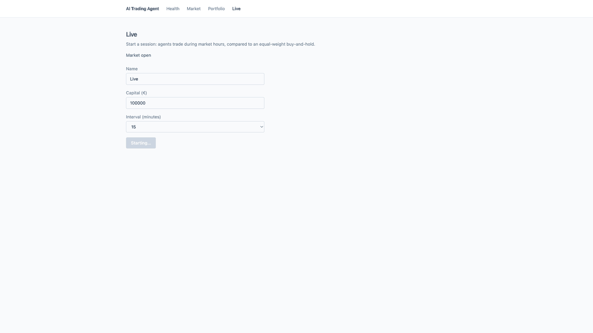
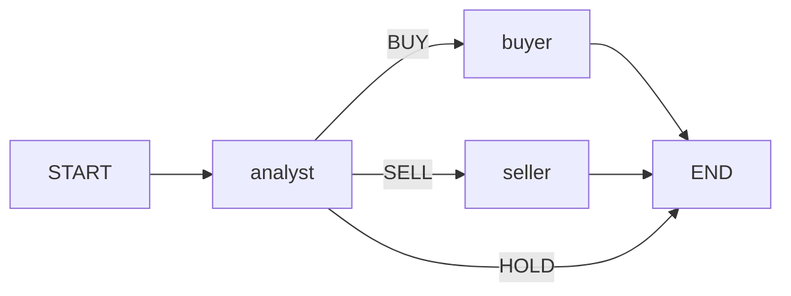

# AI-Trading-Agent

A fleet of AI trading agents on a simulated real-time market. The goal is to analyse profits and
losses and find out whether LLM agents can beat a buy-and-hold book on the CAC 40.

> Work in progress: this README grows with each development phase.

## What if a team of AI agents managed your portfolio? Could they beat the CAC 40?

LLM agents read the charts, forecast where French stocks are heading, and trade them in real
time on live market data, with a simulated portfolio. Their results are compared with an
equal-weight buy-and-hold book, using the same brokerage fees and French FTT.

- **Live mode:** during Euronext hours, the agents analyse the universe on a 5–30 minute slot
  and place orders that a simulated broker fills (next tradeable price + 0.05 % slippage).
- **Replay mode:** past months are replayed day by day to measure performance quickly, using
  only the data available at each simulated moment *(coming next)*.



## How a live session works

1. **Start** creates two portfolios with the same capital: one for the agents (flat) and one
   **buy-and-hold** twin that buys the universe once, equal weight, then never trades again.
2. While the session is `RUNNING`, a scheduler ticks every minute. If Euronext Paris is open
   and the current analysis slot is new, it runs one **cycle**:
   - refresh 5-minute bars;
   - fill pending orders;
   - run the agent graph on each tradable ticker *(agents session only)*;
   - store an equity point (cash + mark-to-market).
3. The Live page polls every 30 seconds: market clock, next cycle countdown, both equity
   curves, the selected ticker’s 5-minute chart with buy/sell markers, and the decision feed.

The Python layer keeps the LLM in a box: quantities are recomputed in code, prices are read
`as_of` so nothing sees the future, and the same slot is never analysed twice.

## Agent graph (LangGraph)

Three agents, one shared state. None of them calls the others. After the analyst, a
conditional edge routes to the buyer, the seller, or `END`.



| Agent | Role |
|---|---|
| **Analyst** | Reads the technical summary and the position. Outputs `BUY`, `SELL`, or `HOLD`. |
| **Buyer** | Sizes a buy. Python clamps the quantity, then the order is placed. |
| **Seller** | Same for a sell. Skips when the book is flat. |

`invoke` runs this graph **once, for one ticker**. The live loop (and later replay) is a
service that calls `invoke` again. Agents are tested with `FakeLLM` so routing does not need
Ollama.

## Tech stack

- **Backend:** Python 3.12, FastAPI, Pydantic v2, SQLAlchemy 2, Alembic, PostgreSQL 16
- **Agents:** LangGraph with a local LLM served by Ollama (`qwen3:8b` by default)
- **Frontend:** Vite, React 19, Tailwind 4, TanStack Query, lightweight-charts
- **Tooling:** uv, ruff, mypy (strict), pytest, Vitest, GitHub Actions, Docker Compose

## Project structure

```
backend/app/
├── agents/         # analyst, buyer, seller, LangGraph
├── routers/        # HTTP
├── schemas/
├── services/       # portfolio, broker, live cycle, scheduler
└── llm.py          # OllamaLLM / FakeLLM
frontend/src/       # Market, Portfolio, Live
```

Routers only handle HTTP and delegate to services.

## Getting started

Prerequisites: [uv](https://docs.astral.sh/uv/), Docker, GNU Make, Node.js, and
[Ollama](https://ollama.com/) with `qwen3:8b`.

```bash
cp .env.example .env
make install
make db-up
make migrate
ollama pull qwen3:8b
make run            # API + live scheduler — http://localhost:8000
make front          # http://localhost:5173  (proxies /api)
```

Load daily bars once (needed by the analyst):

```bash
curl -X POST http://localhost:8000/api/v1/instruments/sync-prices \
  -H 'Content-Type: application/json' \
  -d '{"start":"2024-01-01"}'
```

Then open **Live**, pick a 5-minute interval, and start a session **during Euronext hours**
(weekdays ~09:00–17:30 Paris). The first cycle runs on the next scheduler tick (~1 minute).
A full pass over 10 tickers takes about one to two minutes (Yahoo + local LLM). The page
then shows decisions and the first equity point.

- Health: `curl http://localhost:8000/api/v1/health`
- API docs: http://localhost:8000/docs

## Development

| Command | Description |
|---|---|
| `make test` | Backend unit tests |
| `make test-int` | Integration tests (PostgreSQL) |
| `make test-all` | All backend tests except LLM, with coverage |
| `make front-test` | Frontend unit tests |
| `make lint` / `make format` | Check / fix backend style |
| `make typecheck` | Backend type checking |
| `make migration m="..."` | Generate a database migration |

## Disclaimer

This project is a research and technical showcase. It is not investment advice, and no real
orders are ever sent to any market. The local model is often wrong; the guardrails and the
buy-and-hold comparison are there so that is visible.

## License

[MIT](LICENSE)
